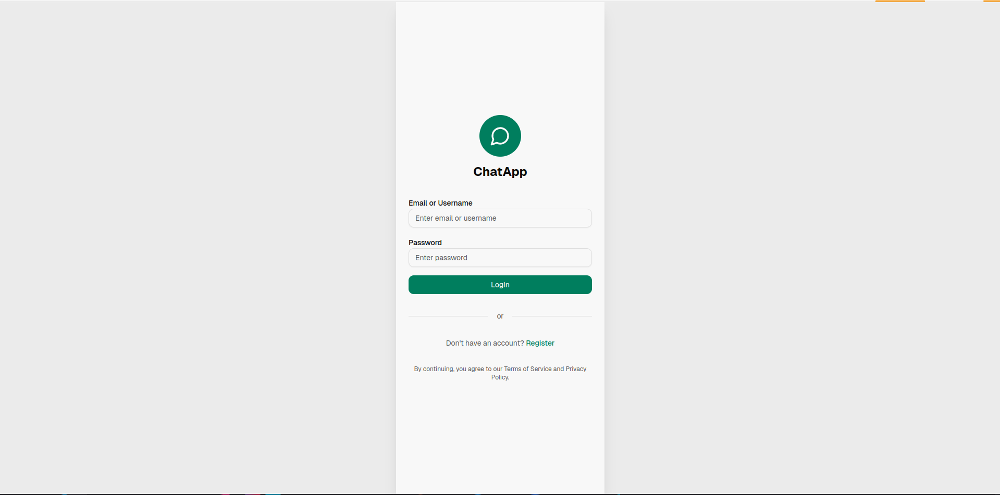
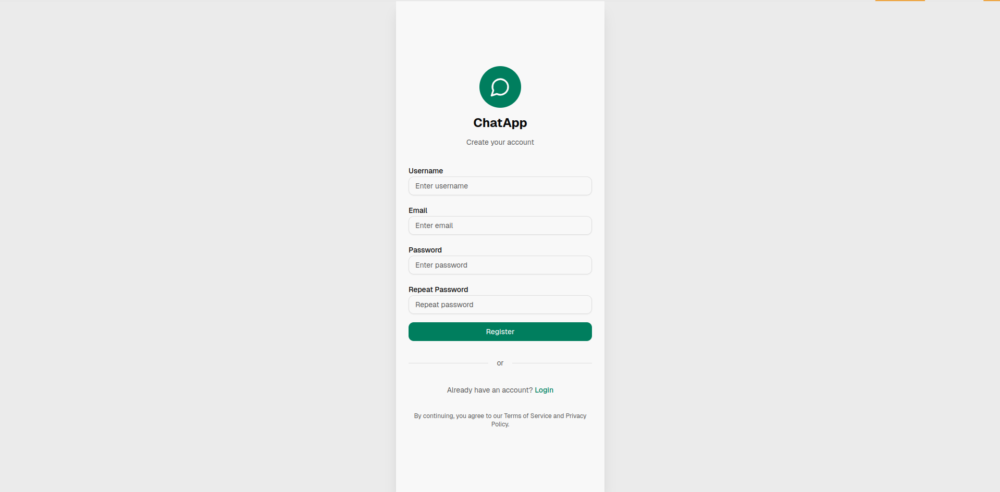
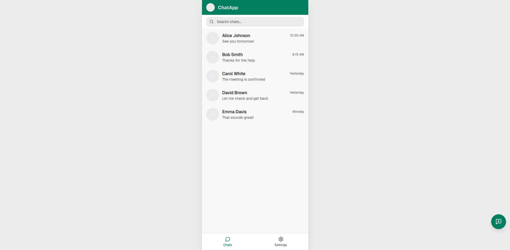
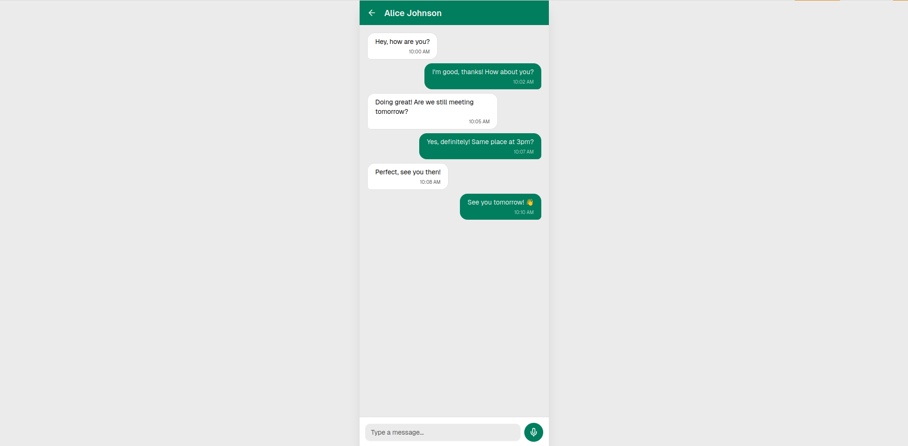
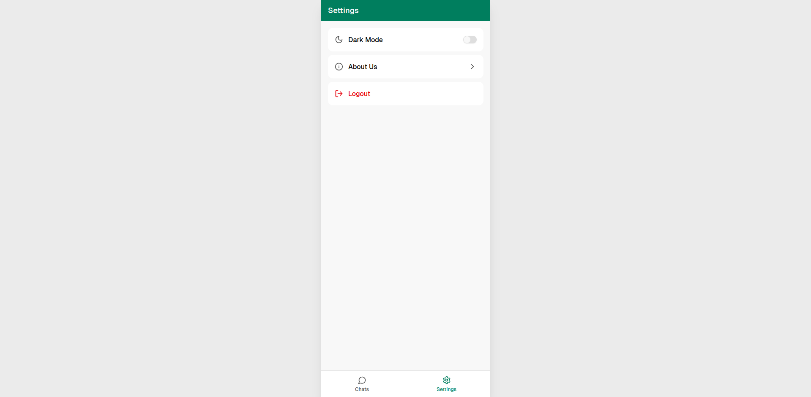

# 💬 ChatApp - WhatsApp Clone

A modern Android messaging application built with Kotlin and Jetpack Compose, featuring real-time chat capabilities, contact integration, and Firebase backend services.

## 📱 About

This project is a simplified clone of WhatsApp, developed for an Android development course. It showcases modern Android development practices including:

- **MVVM Architecture** with clean separation of concerns
- **Jetpack Compose** for declarative UI
- **Firebase** for authentication and real-time messaging
- **Room Database** for local data persistence
- **Repository Pattern** for data management
- **Material Design 3** for modern UI/UX

## ✨ Features

- 🔐 **User Authentication** - Secure registration and login with Firebase Auth
- 💬 **Real-time Messaging** - Instant messaging with Firebase Firestore
- 📱 **Contact Integration** - Access device contacts to start chats
- 💾 **Offline Support** - Local caching with Room Database
- 🌙 **Dark Mode** - Theme switching with preference persistence
- 🔍 **Search** - Find chats and contacts quickly
- 🌐 **REST API Integration** - Fetch external data (e.g., quotes API)
- ⚙️ **Settings** - Customize app preferences
- 🔄 **Background Sync** - WorkManager for periodic data synchronization

## 🛠️ Tech Stack

### Core Technologies
- **Language:** Kotlin
- **UI Framework:** Jetpack Compose
- **Architecture:** MVVM (Model-View-ViewModel)
- **Navigation:** Navigation Compose

### Backend & Database
- **Authentication:** Firebase Authentication
- **Real-time Database:** Firebase Firestore
- **Local Database:** Room Database
- **Data Persistence:** DataStore / SharedPreferences

### Libraries & Tools
- **Dependency Injection:** (To be added)
- **Networking:** Retrofit (for REST API)
- **Background Tasks:** WorkManager
- **Testing:** JUnit, Espresso, Compose UI Testing

## 📐 Architecture

The project follows **MVVM (Model-View-ViewModel)** architecture with a clean, layered structure:

```
┌─────────────────────────────────────┐
│           UI Layer                  │
│    (Compose Screens + ViewModels)   │
└──────────────┬──────────────────────┘
               │
┌──────────────▼──────────────────────┐
│        Repository Layer             │
│  (Data Abstraction & Business Logic)│
└──────────────┬──────────────────────┘
               │
       ┌───────┴────────┐
       │                │
┌──────▼──────┐  ┌──────▼──────┐
│ Local DB    │  │  Remote     │
│ (Room)      │  │  (Firebase)  │
└─────────────┘  └─────────────┘
```

## 📁 Project Structure

```
com.chat.app/
│
├── data/
│   ├── local/
│   │   ├── AppDatabase.kt
│   │   ├── dao/
│   │   │   ├── UserDao.kt
│   │   │   ├── ChatDao.kt
│   │   │   └── MessageDao.kt
│   │   └── entities/
│   │       ├── UserEntity.kt
│   │       ├── ChatEntity.kt
│   │       └── MessageEntity.kt
│   │
│   ├── remote/
│   │   ├── firebase/
│   │   │   ├── FirebaseAuthManager.kt
│   │   │   ├── FirebaseChatService.kt
│   │   │   └── FirebaseUserService.kt
│   │   ├── api/
│   │   │   ├── ApiService.kt
│   │   │   └── ApiModels.kt
│   │
│   └── repository/
│       ├── AuthRepository.kt
│       ├── UserRepository.kt
│       ├── ChatRepository.kt
│       ├── MessageRepository.kt
│       ├── ContactsRepository.kt
│       └── ApiRepository.kt
│
├── domain/
│   ├── models/
│   ├── mappers/
│   └── usecases/        // optional
│
├── ui/
│   ├── login/
│   │   ├── LoginScreen.kt
│   │   └── LoginViewModel.kt
│   ├── register/
│   │   ├── RegisterScreen.kt
│   │   └── RegisterViewModel.kt
│   ├── home/
│   │   ├── HomeScreen.kt
│   │   └── HomeViewModel.kt
│   ├── contacts/
│   │   ├── ContactsScreen.kt
│   │   └── ContactsViewModel.kt
│   ├── chatdetails/
│   │   ├── ChatDetailsScreen.kt
│   │   └── ChatDetailsViewModel.kt
│   ├── settings/
│   │   ├── SettingsScreen.kt
│   │   └── SettingsViewModel.kt
│   └── components/
│
├── utils/
│   ├── validators/
│   └── extensions/
│
└── App.kt
```

## 🚀 Getting Started

### Prerequisites

- **Android Studio** Hedgehog (2023.1.1) or later
- **JDK 11** or higher
- **Android SDK** (API 33+)
- **Firebase Account** (for backend services)

### Installation

1. **Clone the repository**
   ```bash
   git clone https://github.com/Hazem-BackEnd/android-final-project.git
   cd android-final-project
   ```

2. **Open in Android Studio**
   - Open Android Studio
   - Select "Open an Existing Project"
   - Navigate to the cloned directory

3. **Firebase Setup**
   - Create a new project in [Firebase Console](https://console.firebase.google.com/)
   - Add an Android app to your Firebase project
   - Download `google-services.json`
   - Place it in `app/` directory

4. **Configure Local Properties**
   - Create or update `local.properties` if needed
   - Ensure all Firebase configurations are correct

5. **Sync and Build**
   - Click "Sync Project with Gradle Files"
   - Wait for dependencies to download
   - Build and run the project

### Required Permissions

The app requires the following permissions (configured in `AndroidManifest.xml`):

- `READ_CONTACTS` - To access device contacts
- `INTERNET` - For network operations

## 📋 Development Roadmap

The project is organized into logical stages with clear dependencies. Each stage must be completed before moving to dependent stages.

---

### 🧱 Stage 0 — Project Setup

**Dependencies:** None  
**Status:** ✅ Foundation must be completed first

#### Tasks:
- [x] Create Android Project
- [ ] Add Jetpack Compose setup
- [ ] Add Navigation Compose
- [ ] Add Room dependencies
- [ ] Add Firebase (Auth + Firestore)
- [ ] Connect app to Firebase Console
- [ ] Add permissions in manifest
  - `READ_CONTACTS`
  - `INTERNET`
- [ ] Add DataStore or SharedPreferences (for session management)

---

### 🧱 Stage 1 — Authentication Layer

**Dependencies:** Stage 0  
**Status:** 🔄 Core authentication functionality

#### Tasks:
- [ ] Create `AuthRepository` (interface for Firebase Auth)
- [ ] Setup `FirebaseAuthManager`
- [ ] Register flow:
  - `createUser`
  - Save username in Firestore
- [ ] Login flow:
  - `signInWithEmailAndPassword`
- [ ] Session handling
- [ ] Local `UserEntity` + `UserDao` + `UserRepository`

#### UI Screens (depends on AuthRepository & AuthViewModel):
- [ ] `LoginScreen`
- [ ] `RegisterScreen`

> **Note:** UI screens depend on Stage 1 completion

---

### 🧱 Stage 2 — Database Layer (Room)

**Dependencies:** Stage 0  
**Status:** 🔄 Local data persistence

#### Tasks:
- [ ] Create Entities:
  - `UserEntity`
  - `ChatEntity`
  - `MessageEntity`
- [ ] Create DAOs:
  - `UserDao`
  - `ChatDao`
  - `MessageDao`
- [ ] Create `AppDatabase`
- [ ] Create Repositories:
  - `ChatRepository`
  - `MessageRepository`
- [ ] Implement CRUD operations

> **Why before UI?** UI depends on Repositories for data access.

---

### 🧱 Stage 3 — Contacts Access

**Dependencies:** Stage 0 only

#### Tasks:
- [ ] Setup permission launcher (`READ_CONTACTS`) in UI
- [ ] Write `ContactsRepository`
- [ ] Build `ContactsScreen` UI
- [ ] Convert Contact object to Chat creation (link with Stage 2)

#### Dependencies:
- `ContactsRepository`
- `ChatRepository`

---

### 🧱 Stage 4 — Firebase Chat (Real-time Messaging)

**Dependencies:**
- ✅ Auth ready
- ✅ Firestore ready
- ✅ Room ready
- ✅ Repositories ready

#### Tasks:
- [ ] `FirebaseChatService`:
  - `createChat`
  - `createMessage`
  - `listenForMessages`
- [ ] Sync messages:
  - Listener Firebase → Save to Room
  - Room Observing → UI updates
- [ ] Handle chat list sync:
  - Firebase snapshot listener for chats
  - Save to Room
- [ ] Create `ChatDetailsViewModel`
- [ ] `ChatDetailsScreen` UI

#### Dependencies:
- `MessageRepository`
- `FirebaseChatService`
- `ChatRepository`

---

### 🧱 Stage 5 — Main UI (Home + Chat List + Navigation)

**Dependencies:**
- ✅ Auth
- ✅ Room
- ✅ Firebase Chat

#### Tasks:
- [ ] BottomNavigation setup
- [ ] `HomeScreen` (Chats List):
  - `LazyColumn`
  - Search functionality
- [ ] FAB → navigate to Contacts
- [ ] Chat item click → `ChatDetails`

---

### 🧱 Stage 6 — Settings + Theme + Logout

**Dependencies:** Auth + DataStore

#### Tasks:
- [ ] Dark mode toggle & save preference
- [ ] Logout (clear Firebase + Local DB)
- [ ] About Us → (Use public API requirement)
- [ ] Settings UI

---

### 🧱 Stage 7 — Network Integration (Public REST API)

**Dependencies:** None

#### Tasks:
- [ ] Choose an API (e.g., Quotes API)
- [ ] Write `ApiService` with Retrofit
- [ ] About Us screen → fetch random quote
- [ ] Handle states:
  - Loading
  - Error
  - Success

---

### 🧱 Stage 8 — Testing

**Dependencies:** All previous stages complete

#### Tasks:
- [ ] **3 Unit Tests:**
  - `LoginViewModelTest`
  - `RegisterViewModelTest`
  - `ChatListViewModelTest`
- [ ] **1 UI Test:**
  - `LoginScreen` test using Compose UI test

---

### 🧱 Stage 9 — WorkManager (Bonus)

**Dependencies:** Local DB + Firebase Layer

#### Tasks:
- [ ] Worker to sync chats/messages every X hours
- [ ] Add constraints (internet only)
- [ ] Manual trigger optional

---

## 🧪 Testing

The project includes comprehensive testing:

### Unit Tests
- ViewModel tests for business logic
- Repository tests for data operations
- Utility function tests

### UI Tests
- Compose UI tests for screen interactions
- Navigation tests
- Integration tests

### Running Tests
```bash
# Run all unit tests
./gradlew test

# Run all instrumented tests
./gradlew connectedAndroidTest
```

## 📦 Dependencies

### Current Dependencies
- **Jetpack Compose BOM:** `2025.12.00`
- **Kotlin:** `2.2.21`
- **Android Gradle Plugin:** `8.13.1`
- **Core KTX:** `1.17.0`
- **Lifecycle Runtime KTX:** `2.10.0`
- **Activity Compose:** `1.12.1`

### To Be Added
- Firebase BOM
- Room Database
- Navigation Compose
- Retrofit
- WorkManager
- DataStore

## 🤝 Contributing

Contributions are welcome! Please follow these steps:

1. Fork the repository
2. Create a feature branch (`git checkout -b feature/AmazingFeature`)
3. Commit your changes (`git commit -m 'Add some AmazingFeature'`)
4. Push to the branch (`git push origin feature/AmazingFeature`)
5. Open a Pull Request

## 📝 License

This project is developed for educational purposes as part of an Android development course.

## 👥 Authors

- **Hazem Mostafa** - [GitHub](https://github.com/Hazem-BackEnd)
- **Ahmed Hassan** - [GitHub](https://github.com/Capa11)
- **Mahmoud Adel** - [GitHub](https://github.com/devMahmoudAdel)
- **Mariam Ibrahim** - [GitHub](https://github.com/Idkmariam)


## 🙏 Acknowledgments

- WhatsApp for design inspiration
- Firebase for backend services
- Android Jetpack team for excellent libraries
- The Android developer community

---
## 📱 App Screens





---

## 📊 Project Status

**Current Stage:** Stage 0 - Project Setup  
**Overall Progress:** 🟡 In Development

---

> **Note:** This project follows a structured development approach. Each stage builds upon previous stages, ensuring a solid foundation before adding complex features.
